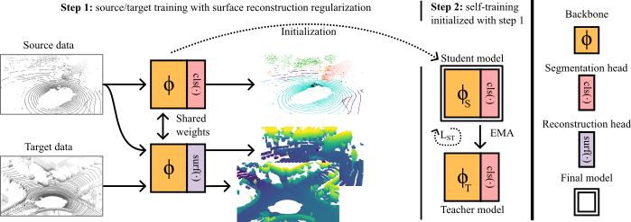

<div align='center'>

# SALUDA: Surface-based Automotive Lidar Unsupervised Domain Adaptation

[Björn Michele](https://github.com/BjoernMichele)<sup>1,3</sup>&nbsp;&nbsp;
[Alexandre Boulch](https://boulch.eu/)<sup>1</sup>&nbsp;&nbsp;&nbsp;
[Gilles Puy](https://sites.google.com/site/puygilles/)<sup>1</sup>&nbsp;&nbsp;&nbsp;
[Tuan-Hung Vu](https://tuanhungvu.github.io/)<sup>1</sup>&nbsp;&nbsp;&nbsp;
[Renaud Marlet](http://imagine.enpc.fr/~marletr/)<sup>1,2</sup>&nbsp;&nbsp;
[Nicolas Courty](https://people.irisa.fr/Nicolas.Courty/)<sup>3</sup>&nbsp;&nbsp;&nbsp;

<sub>
<sup>1</sup> Valeo.ai, Paris, France&nbsp;
<sup>2</sup> LIGM, Ecole des Ponts, Univ Gustave Eiffel, CNRS, Marne-la-Vallée, France

<sup>3</sup> CNRS, IRISA, Univ. Bretagne Sud, Vannes, France
</sub>

<br/>

[](https://arxiv.org/abs/2304.03251)




</div>

<br/>


## Abstract
Learning models on one labeled dataset that generalize well on another domain is a difficult task, as several shifts might happen between the data domains. This is notably the case for lidar data, for which models can exhibit large performance discrepancies due for instance to different lidar patterns or changes in acquisition conditions. This paper addresses the corresponding Unsupervised Domain Adaptation (UDA) task for semantic segmentation. To mitigate this problem, we introduce an unsupervised auxiliary task of learning an implicit underlying surface representation simultaneously on source and target data. As both domains share the same latent representation, the model is forced to accommodate discrepancies between the two sources of data. This novel strategy differs from classical minimization of statistical divergences or lidar-specific state-of-the-art domain adaptation techniques. Our experiments demonstrate that our method achieves a better performance than the current state of the art in synthetic-to-real and real-to-real scenarios.

---

## Dependencies

This code was implemented and tested with python 3.10, PyTorch 1.11.0 and CUDA 11.3.
The backbone is implemented with version 1.4.0 of [Torchsparse](https://github.com/mit-han-lab/torchsparse.)([Exact commit](https://github.com/mit-han-lab/torchsparse/commit/69c1034ddb285798619380537802ea0ff03aeba6))
Additionally, [Sacred](https://github.com/IDSIA/sacred) 0.8.3 is used. 

---

## Training 

(not yet included, watch the repository to not miss the updates)

---

## Evaluation

Evaluation of a SALUDA model on nuScenes to SemanticKITTI: 

```
python da_baseline_hyper.py --name='EVAL_SALUDA_ns_sk' with da_ns_sk network_decoder=InterpAllRadiusNoDirsNet network_decoder_k=1.0 save_dir=results_val/ ckpt_path_model=path/to/folder
```

Evaluation on SyntheticLiDAR to SemanticKITTI:

```
python da_baseline_hyper.py --name='EVAL_SALUDA_syn_sk' with da_syn_sk network_decoder=InterpAllRadiusNoDirsNet network_decoder_k=1.0 save_dir=results_val/ ckpt_path_model=path/to/folder
```


Evaluation of a SALUDA model which was refined with CoSMix: 

```
python da_baseline_hyper.py --name='EVAL_SALUDA_ns_sk' with da_ns_sk network_decoder=InterpAllRadiusNoDirsNet network_decoder_k=1.0 save_dir=results_val/ cosmix_backbone=True ckpt_path_model=path/to/folder
```

---
## Model zoo

DA Setting | Method | Backbone | Link |
---|---|---|---|
nuScenes to SemanticKITTI | SALUDA w/o ST |TorchSparse-MinkUNet  | [CKPT](https://github.com/valeoai/SALUDA/releases/download/v0.0.0/ns_sk_saluda.zip) |
SyntheticLiDAR to SemanticKITTI | SALUDA  w/o ST |TorchSparse-MinkUNet  |  [CKPT](https://github.com/valeoai/SALUDA/releases/download/v0.0.0/syn_sk_saluda.zip) |

The checkpoint should is placed in a folder. The link to this folder should be given to the "ckpt_path_model" parameter.  

---

## Acknowledgments

This project would not have been possible without many community resources and repositories. Among them:

- [ALSO](https://github.com/valeoai/ALSO/)
- [POCO](https://github.com/valeoai/POCO)
- [CoSMix](https://github.com/saltoricristiano/cosmix-uda/)
- [SynLiDAR](https://github.com/xiaoaoran/SynLiDAR)
- [Torchsparse](https://github.com/mit-han-lab/torchsparse)

Please, consider acknowleding these projects.

---

## License

This work released under the terms of the [Apache 2.0 license](LICENSE).
